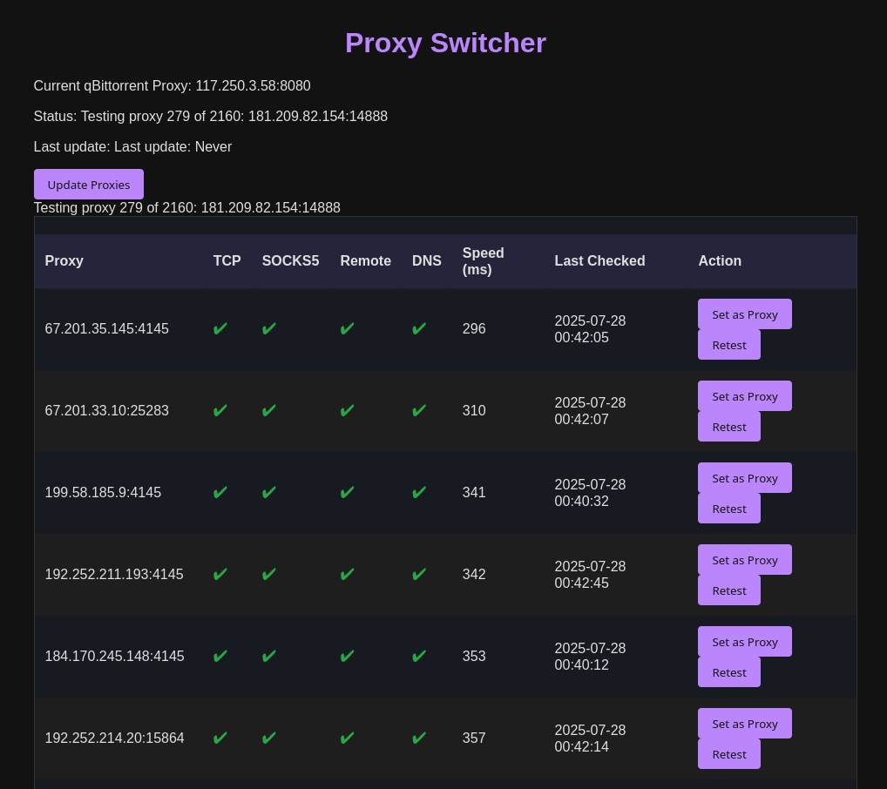

# Proxy Switcher Dashboard




A Flask-based web dashboard for managing, testing, and switching SOCKS5 proxies. Designed to work seamlessly with qBittorrent, enabling you to fetch public proxy lists, test their connectivity and SOCKS5 compatibility, and set qBittorrent's active proxy via a modern, sortable web UI.

---

## Features

* **Fetches fresh SOCKS5 proxy lists** from multiple configurable sources.
* **Tests each proxy** for TCP connectivity, SOCKS5 handshake, remote connect, and DNS relay support.
* **Displays test results** with icons and speed (ms), sortable by any column.
* **Multi-threaded** proxy testing for fast batch validation (5 at a time by default).
* **One-click set as qBittorrent proxy** (via Web API integration).
* **Proxy and qBittorrent status** displayed and live-updated.
* **Auto-sorts** by best-performing proxies by default.
* **.env file support** for all sensitive credentials (no secrets in source).

---

## Setup Instructions

### 1. Clone and Install Requirements

```sh
git clone https://github.com/yourname/proxy-switcher-dashboard.git
cd proxy-switcher-dashboard
pip install -r requirements.txt
```

### 2. Set Up Environment Variables

Create a `.env` file in the project root:

```ini
QBITTORRENT_HOST=localhost
QBITTORRENT_PORT=7070
QBITTORRENT_USERNAME=admin
QBITTORRENT_PASSWORD=yourqbitpass
```

### 3. Add Proxy Sources

Create or edit `sources.txt` (one proxy source URL per line):

```
https://raw.githubusercontent.com/TheSpeedX/PROXY-List/master/socks5.txt
https://raw.githubusercontent.com/jetkai/proxy-list/main/online-proxies/txt/proxies-socks5.txt
...
```

### 4. Run the App

```sh
python app.py
```

* Web UI launches at `http://localhost:4141/` (or server IP).

---

## Usage

* Click **"Update Proxies"** to fetch and test all available proxies.
* Test results update live: green check for pass, red X for fail, gray ? for not yet tested.
* Click any column header to sort by that result (e.g., fastest SOCKS5s, all passing, etc).
* Click **"Set as Proxy"** to set the given proxy for qBittorrent.
* Last check time and current qBittorrent status are shown at the top.

---

## Customization

* **Add/Remove proxy sources:** Edit `sources.txt`.
* **Tune batch size:** Adjust `max_workers` in `ProxyManager.test_all_proxies` for more or fewer concurrent tests.
* **Change qBittorrent integration:** See `qbittorrent_manager.py`.
* **Change which tests run:** Edit `ProxyManager.test_proxy`.

---

## Dependencies

* Python 3.7+
* Flask
* Requests
* python-dotenv
* PySocks
* schedule

---

## Security Note

This app is intended for personal or research use on your own infrastructure. Do **not** expose it to the public internet without access control!

---

## License

MIT or Unlicense (choose and edit accordingly)

---

## Credits

* Proxy source links courtesy of the open proxy-list community.
* Original dashboard design and full-stack implementation: \[your name or handle here]

---

## Troubleshooting

* If all proxies fail except TCP, check your outbound firewall or proxy source reliability.
* Ensure you are using **PySocks** (not old `SocksiPy_branch`), and dependencies are up to date.
* To debug individual proxies, see `proxy_manager.py:test_proxy()`.

---
