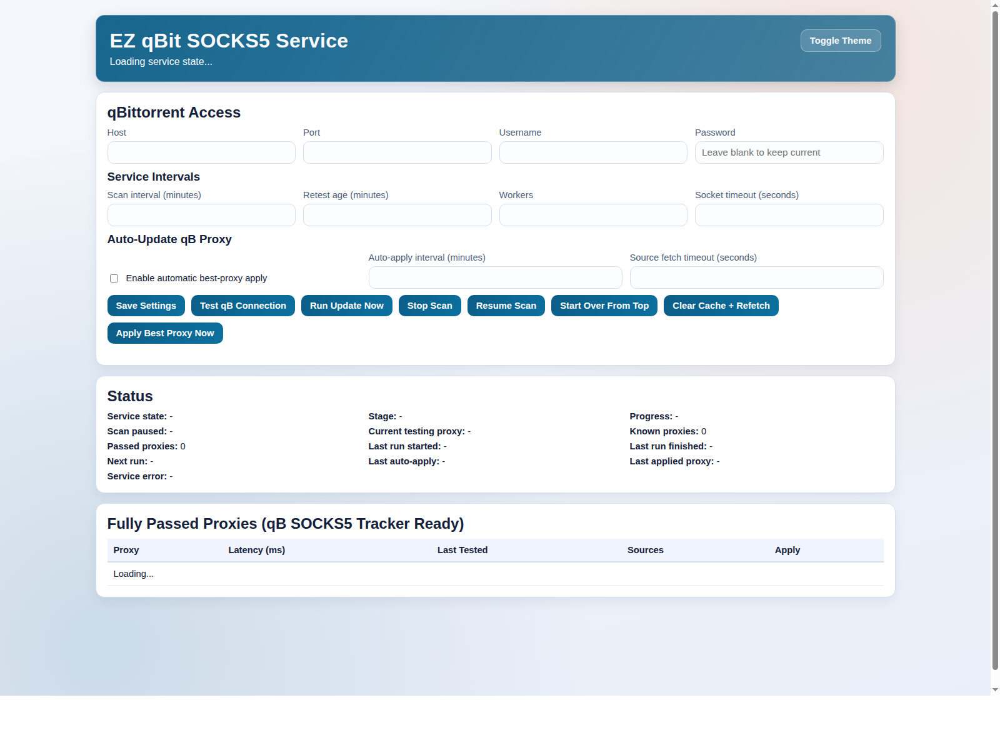

# EZ_qbitsox

Simplified SOCKS5 proxy service for qBittorrent.

The service pulls SOCKS5 proxies from `sources.txt`, tests which ones can pass tracker-level SOCKS5 checks, and exposes a UI/API to apply passing proxies to qBittorrent.

## Screenshot



## What This Version Does

- Loads proxy sources from GitHub lists in `sources.txt`.
- Normalizes and deduplicates `ip:port` candidates.
- Tests SOCKS5 readiness for qBittorrent-style usage:
  - TCP connect to proxy
  - SOCKS5 handshake
  - tracker TCP reachability
  - tracker UDP reachability
- Stores service state on disk (`data/proxy_state.json`).
- Stores qBittorrent credentials/settings encrypted at rest (`data/secure_settings.enc`).
- Shows only sources with at least one fully passed proxy.
- Shows only fully passed proxies in the UI.
- Supports periodic refresh/retest as a background service loop.
- Supports manual proxy apply and auto-apply best proxy at a chosen interval.
- Scans through the full fetched proxy list and persists scan position across restarts.
- Supports scan controls: stop, resume, restart from top, clear cache + refetch.
- Includes a dark/light theme toggle in the dashboard.

## Install

```bash
python -m venv .venv
source .venv/bin/activate
pip install -r requirements.txt
```

## Run

```bash
cp .env-sample .env
python app.py
```

Default URL: `http://localhost:7272`

## UI Workflow

1. Open the app.
2. Set qBittorrent host/port/username/password and save.
3. Click `Test qB Connection` to verify API connectivity/auth before proxy actions.
4. Click `Run Update Now` to fetch and start a full-list scan.
5. Use scan controls:
   - `Stop Scan` pauses at the current position.
   - `Resume Scan` continues from the saved cursor.
   - `Start Over From Top` restarts from index `0` of the current plan.
   - `Clear Cache + Refetch` wipes saved proxy state and rebuilds from sources.
6. Apply manually from the passed proxy table or click `Apply Best Proxy Now`.
7. Enable `Auto-Update qB Proxy` and set interval if you want continuous automatic proxy switching.

## Service Behavior

- Background scheduler checks on a short loop and triggers source refresh according to `scan_interval_minutes`.
- A scan walks the entire current proxy plan until complete.
- Scan cursor is stored in `data/proxy_state.json`, so restart resumes where it left off.
- Scheduled runs start a fresh source refresh and new full-list scan when interval is reached.

## API Endpoints

- `GET /api/state` - full dashboard state (passed sources/proxies + service status)
- `POST /api/settings` - save encrypted settings
- `POST /api/run-now` - trigger immediate fetch/test run
- `POST /api/scan/stop` - pause active scan
- `POST /api/scan/resume` - resume paused/incomplete scan
- `POST /api/scan/restart` - restart scan from top of current plan
- `POST /api/scan/clear-refetch` - clear cache and start a fresh refetch+scan
- `POST /api/qb/test` - test qBittorrent connectivity/auth and return version/proxy status
- `POST /api/proxy/apply` - apply a specific proxy (`{"proxy":"ip:port"}`)
- `POST /api/proxy/apply-best` - apply best currently passed proxy
- `GET /api/health` - health probe

## Notes

- Public free proxies are unstable and frequently malicious. Treat all traffic as untrusted.
- This tool only verifies network readiness signals; it does not guarantee sustained download performance.
- Keep `data/` private. It contains encrypted settings and runtime state.
