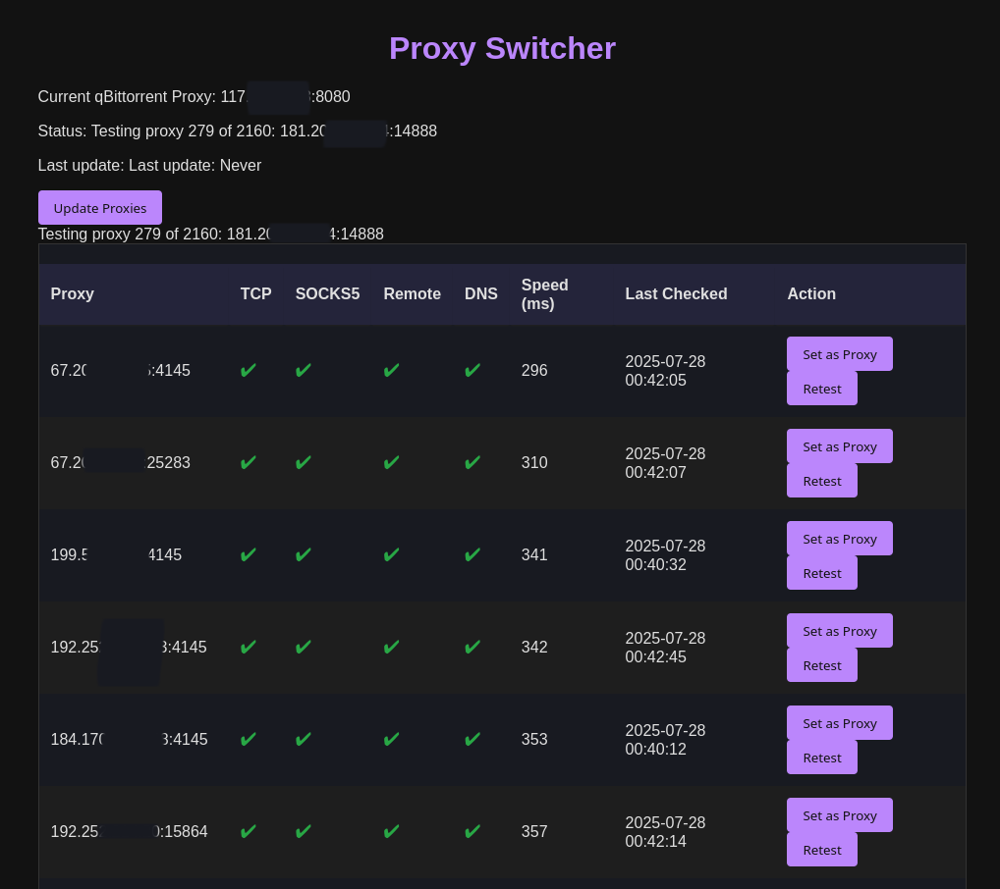

# Proxy Switcher Dashboard with qBittorrent Integration



A Flask-based dashboard for downloading, testing, and managing SOCKS5 proxies. Provides live testing for multiple proxy criteria, sortable web UI, and push-to-qBittorrent proxy rotation.

## Features

* Fetches SOCKS5 proxy lists from configurable sources
* Runs detailed, multi-step proxy health checks (TCP, SOCKS5 handshake, remote connect, DNS)
* Displays sortable, sticky-table results in browser
* Allows one-click proxy selection for qBittorrent Web UI
* Tracks and caches test results with timestamp and speed
* Background scheduler for auto-refreshing and retesting proxies
* Environment-variable driven (no plaintext credentials)
* Ready for service/daemon operation

## Requirements

* Python 3.8+
* [qBittorrent](https://www.qbittorrent.org/) with Web UI enabled
* Flask
* Requests
* PySocks (`SocksiPy_branch`)
* python-dotenv
* schedule

Install requirements:

```
pip install -r requirements.txt
```

## Quick Start

1. **Copy and configure environment**

   Use the included `.env-sample` to create your real `.env`:

   ```bash
   cp .env-sample .env
   ```

   Edit `.env` to match your qBittorrent Web UI instance:

   * `QBITTORRENT_HOST` (default: localhost)
   * `QBITTORRENT_PORT` (default: 8080)
   * `QBITTORRENT_USERNAME` (default: admin)
   * `QBITTORRENT_PASSWORD` (default: adminadmin)

2. **Configure proxy sources**

   Edit `sources.txt` (one proxy-list URL per line). Preloaded with recommended public SOCKS5 lists.

3. **Run the server**

   ```bash
   python app.py
   ```

   Visit [http://localhost:4141](http://localhost:4141) (or your specified port) in your browser.

4. **Using the dashboard**

   * Update proxies (fetches new list, runs all tests)
   * Sort/filter by column
   * Click to set working proxy for qBittorrent (pushes directly via API)
   * Retest or re-check any proxy
   * Monitor progress and qBittorrent status live

## File Overview

* `app.py`: Main Flask server
* `proxy_manager.py`: Downloads, tests, caches proxies, scoring & sorting
* `qbittorrent_manager.py`: Handles qBittorrent login, read/write proxy config
* `scheduler.py`: Schedules retests, auto-updates, etc
* `static/`: CSS, JS
* `templates/`: HTML (Jinja2)
* `sources.txt`: List of proxy sources
* `.env` / `.env-sample`: Environment config (keep `.env` secret!)
* `requirements.txt`: All Python dependencies

## Security Notes

* Keep your real `.env` **private**! Never commit it to a public repo.
* Dashboard does not expose any admin or proxy-changing endpoint without authentication.
* Proxy credentials are never shown or saved in browser.

## Known Limitations & Roadmap

* Currently tests only SOCKS5 public proxies; other proxy types or private proxies will require code changes
* **Upcoming:**

  * Systemd/service support for running as a daemon
  * Automatic periodic updating/retesting of proxy list (runs even if dashboard not open)
  * Auto-rotate qBittorrent's proxy at intervals, or by measured performance
  * Improved error/timing diagnostics and public test logs

## Troubleshooting

* If all proxies fail except TCP, try again later or use a different list source
* Check qBittorrent Web UI address/credentials match those in `.env`
* If nothing loads, check for Python errors in the terminal, missing packages, or port conflicts
* Windows: PySocks may require extra install: `pip install PySocks` (use `SocksiPy_branch` version)

## Support

Open an issue or request a feature in the repository.

---

© 2025 Eric Zeigenbein / BlahPunk
